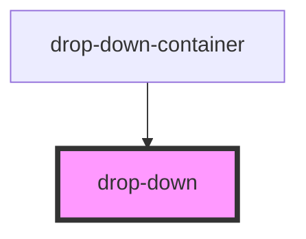

# drop-down

<!-- Auto Generated Below -->

## Properties

| Property      | Attribute | Description | Type                          | Default     |
| ------------- | --------- | ----------- | ----------------------------- | ----------- |
| `closeAction` | --        |             | `(close: () => void) => void` | `undefined` |
| `onOpen`      | --        |             | `(open: boolean) => void`     | `undefined` |

## Dependencies

### Used by

 - [drop-down-container](../drop-down-container)

### Graph

----------------------------------------------

*Built with [StencilJS](https://stenciljs.com/)*
