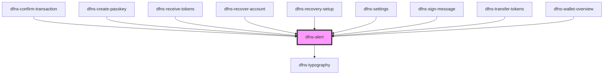

# dfns-alert

<!-- Auto Generated Below -->

## Properties

| Property   | Attribute   | Description | Type                                                                                          | Default              |
| ---------- | ----------- | ----------- | --------------------------------------------------------------------------------------------- | -------------------- |
| `classCss` | `class-css` |             | `string`                                                                                      | `undefined`          |
| `hasTitle` | `has-title` |             | `boolean`                                                                                     | `false`              |
| `variant`  | `variant`   |             | `EAlertVariant.ERROR \| EAlertVariant.INFO \| EAlertVariant.SUCCESS \| EAlertVariant.WARNING` | `EAlertVariant.INFO` |

## Dependencies

### Used by

 - [dfns-confirm-transaction](../../../Pages/dfns-confirm-transaction)
 - [dfns-create-passkey](../../../Pages/dfns-create-passkey)
 - [dfns-receive-tokens](../../../Pages/dfns-receive-tokens)
 - [dfns-recover-account](../../../Pages/dfns-recover-account)
 - [dfns-recovery-setup](../../../Pages/dfns-recovery-setup)
 - [dfns-settings](../../../Pages/dfns-settings)
 - [dfns-sign-message](../../../Pages/dfns-sign-message)
 - [dfns-transfer-tokens](../../../Pages/dfns-transfer-tokens)
 - [dfns-wallet-overview](../../../Pages/dfns-wallet-overview)

### Depends on

- [dfns-typography](../../Typography/dfns-typography)

### Graph

----------------------------------------------

*Built with [StencilJS](https://stenciljs.com/)*
