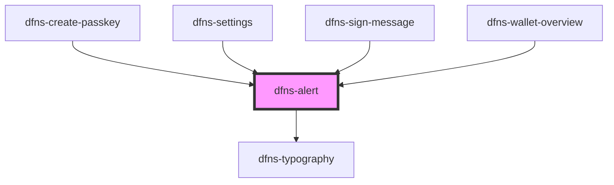

# dfns-alert

<!-- Auto Generated Below -->

## Properties

| Property         | Attribute          | Description | Type                                                                                          | Default                                                                                 |
| ---------------- | ------------------ | ----------- | --------------------------------------------------------------------------------------------- | --------------------------------------------------------------------------------------- |
| `classCss`       | `class-css`        |             | `string`                                                                                      | `undefined`                                                                             |
| `errorIconSrc`   | `error-icon-src`   |             | `string`                                                                                      | `"https://storage.googleapis.com/dfns-frame-stg/assets/icons/x-circle.svg"`             |
| `hasTitle`       | `has-title`        |             | `boolean`                                                                                     | `false`                                                                                 |
| `infoIconSrc`    | `info-icon-src`    |             | `string`                                                                                      | `"https://storage.googleapis.com/dfns-frame-stg/assets/icons/exclamation-circle.svg"`   |
| `variant`        | `variant`          |             | `EAlertVariant.ERROR \| EAlertVariant.INFO \| EAlertVariant.SUCCESS \| EAlertVariant.WARNING` | `EAlertVariant.INFO`                                                                    |
| `warningIconSrc` | `warning-icon-src` |             | `string`                                                                                      | `"https://storage.googleapis.com/dfns-frame-stg/assets/icons/exclamation-triangle.svg"` |

## Dependencies

### Used by

 - [dfns-create-passkey](../../../Pages/dfns-create-passkey)
 - [dfns-settings](../../../Pages/dfns-settings)
 - [dfns-sign-message](../../../Pages/dfns-sign-message)
 - [dfns-wallet-overview](../../../Pages/dfns-wallet-overview)

### Depends on

- [dfns-typography](../../Typography/dfns-typography)

### Graph

----------------------------------------------

*Built with [StencilJS](https://stenciljs.com/)*
