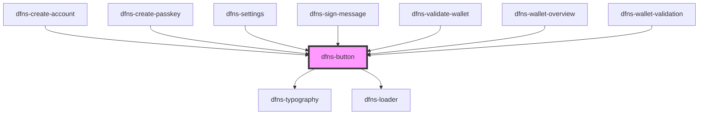

# dfns-button

<!-- Auto Generated Below -->

## Properties

| Property       | Attribute      | Description | Type                                                                                                                            | Default                  |
| -------------- | -------------- | ----------- | ------------------------------------------------------------------------------------------------------------------------------- | ------------------------ |
| `classCss`     | `class-css`    |             | `string`                                                                                                                        | `undefined`              |
| `content`      | `content`      |             | `string`                                                                                                                        | `undefined`              |
| `disabled`     | `disabled`     |             | `boolean`                                                                                                                       | `false`                  |
| `fullwidth`    | `fullwidth`    |             | `boolean`                                                                                                                       | `false`                  |
| `icon`         | --             |             | `Element`                                                                                                                       | `undefined`              |
| `iconposition` | `iconposition` |             | `"left" \| "right"`                                                                                                             | `"right"`                |
| `iconstyle`    | `iconstyle`    |             | `any`                                                                                                                           | `undefined`              |
| `isloading`    | `isloading`    |             | `boolean`                                                                                                                       | `false`                  |
| `onClick`      | --             |             | `() => any`                                                                                                                     | `undefined`              |
| `sizing`       | `sizing`       |             | `EButtonSize.LARGE \| EButtonSize.MEDIUM \| EButtonSize.SMALL`                                                                  | `EButtonSize.LARGE`      |
| `type`         | `type`         |             | `"button" \| "submit"`                                                                                                          | `"button"`               |
| `variant`      | `variant`      |             | `EButtonVariant.NEUTRAL \| EButtonVariant.PRIMARY \| EButtonVariant.SECONDARY \| EButtonVariant.TEXT \| EButtonVariant.WARNING` | `EButtonVariant.PRIMARY` |

## Events

| Event         | Description | Type                |
| ------------- | ----------- | ------------------- |
| `buttonClick` |             | `CustomEvent<void>` |

## Dependencies

### Used by

 - [dfns-create-account](../../../Pages/dfns-create-account)
 - [dfns-create-passkey](../../../Pages/dfns-create-passkey)
 - [dfns-settings](../../../Pages/dfns-settings)
 - [dfns-sign-message](../../../Pages/dfns-sign-message)
 - [dfns-validate-wallet](../../../Pages/dfns-validate-wallet)
 - [dfns-wallet-overview](../../../Pages/dfns-wallet-overview)
 - [dfns-wallet-validation](../../../Pages/dfns-wallet-validation)

### Depends on

- [dfns-typography](../../Typography/dfns-typography)
- [dfns-loader](../../LoaderDfns/dfns-loader)

### Graph

----------------------------------------------

*Built with [StencilJS](https://stenciljs.com/)*
