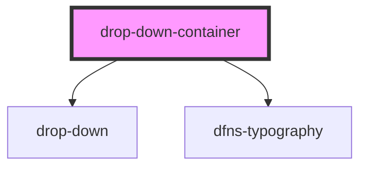

# drop-down-container

<!-- Auto Generated Below -->

## Properties

| Property          | Attribute | Description | Type                                                        | Default |
| ----------------- | --------- | ----------- | ----------------------------------------------------------- | ------- |
| `dropdownContent` | --        |             | `{ children: Element; title: string; content: Element; }[]` | `[]`    |

## Dependencies

### Depends on

- [drop-down](../drop-down)
- [dfns-typography](../../Typography/dfns-typography)

### Graph

----------------------------------------------

*Built with [StencilJS](https://stenciljs.com/)*
