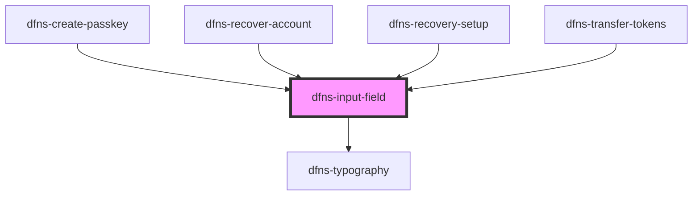

# dfns-input-field

<!-- Auto Generated Below -->

## Properties

| Property            | Attribute             | Description | Type                      | Default     |
| ------------------- | --------------------- | ----------- | ------------------------- | ----------- |
| `disableErrors`     | `disable-errors`      |             | `boolean`                 | `undefined` |
| `errors`            | --                    |             | `string[]`                | `[]`        |
| `fullWidth`         | `full-width`          |             | `boolean`                 | `undefined` |
| `isPasswordVisible` | `is-password-visible` |             | `boolean`                 | `false`     |
| `isReadOnly`        | `is-read-only`        |             | `boolean`                 | `undefined` |
| `label`             | `label`               |             | `string`                  | `undefined` |
| `leftElement`       | `left-element`        |             | `any`                     | `undefined` |
| `onChange`          | --                    |             | `(input: string) => void` | `undefined` |
| `placeholder`       | `placeholder`         |             | `string`                  | `undefined` |
| `rightElement`      | `right-element`       |             | `any`                     | `undefined` |
| `type`              | `type`                |             | `string`                  | `undefined` |
| `value`             | `value`               |             | `string`                  | `undefined` |

## Events

| Event         | Description | Type                  |
| ------------- | ----------- | --------------------- |
| `inputChange` |             | `CustomEvent<string>` |

## Dependencies

### Used by

 - [dfns-create-passkey](../../../../Pages/dfns-create-passkey)
 - [dfns-recover-account](../../../../Pages/dfns-recover-account)
 - [dfns-recovery-setup](../../../../Pages/dfns-recovery-setup)
 - [dfns-transfer-tokens](../../../../Pages/dfns-transfer-tokens)

### Depends on

- [dfns-typography](../../../Typography/dfns-typography)

### Graph

----------------------------------------------

*Built with [StencilJS](https://stenciljs.com/)*
