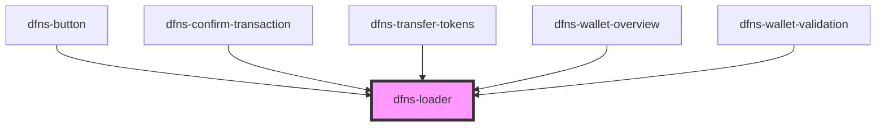

# dfns-loader

<!-- Auto Generated Below -->

## Properties

| Property   | Attribute   | Description | Type                 | Default     |
| ---------- | ----------- | ----------- | -------------------- | ----------- |
| `classCss` | `class-css` |             | `string`             | `undefined` |
| `size`     | `size`      |             | `"large" \| "small"` | `"small"`   |

## Dependencies

### Used by

 - [dfns-button](../../Buttons/dfns-button)
 - [dfns-confirm-transaction](../../../Pages/dfns-confirm-transaction)
 - [dfns-transfer-tokens](../../../Pages/dfns-transfer-tokens)
 - [dfns-wallet-overview](../../../Pages/dfns-wallet-overview)
 - [dfns-wallet-validation](../../../Pages/dfns-wallet-validation)

### Graph

----------------------------------------------

*Built with [StencilJS](https://stenciljs.com/)*
