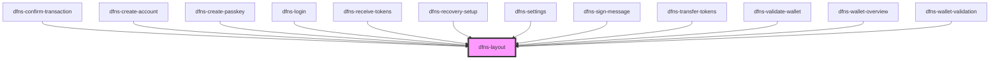

# dfns-layout

<!-- Auto Generated Below -->

## Properties

| Property          | Attribute   | Description | Type         | Default     |
| ----------------- | ----------- | ----------- | ------------ | ----------- |
| `closeBtn`        | `close-btn` |             | `boolean`    | `undefined` |
| `onClickCloseBtn` | --          |             | `() => void` | `undefined` |

## Dependencies

### Used by

 - [dfns-confirm-transaction](../../../Pages/dfns-confirm-transaction)
 - [dfns-create-account](../../../Pages/dfns-create-account)
 - [dfns-create-passkey](../../../Pages/dfns-create-passkey)
 - [dfns-login](../../../Pages/dfns-login)
 - [dfns-receive-tokens](../../../Pages/dfns-receive-tokens)
 - [dfns-recovery-setup](../../../Pages/dfns-recovery-setup)
 - [dfns-settings](../../../Pages/dfns-settings)
 - [dfns-sign-message](../../../Pages/dfns-sign-message)
 - [dfns-transfer-tokens](../../../Pages/dfns-transfer-tokens)
 - [dfns-validate-wallet](../../../Pages/dfns-validate-wallet)
 - [dfns-wallet-overview](../../../Pages/dfns-wallet-overview)
 - [dfns-wallet-validation](../../../Pages/dfns-wallet-validation)

### Graph

----------------------------------------------

*Built with [StencilJS](https://stenciljs.com/)*
