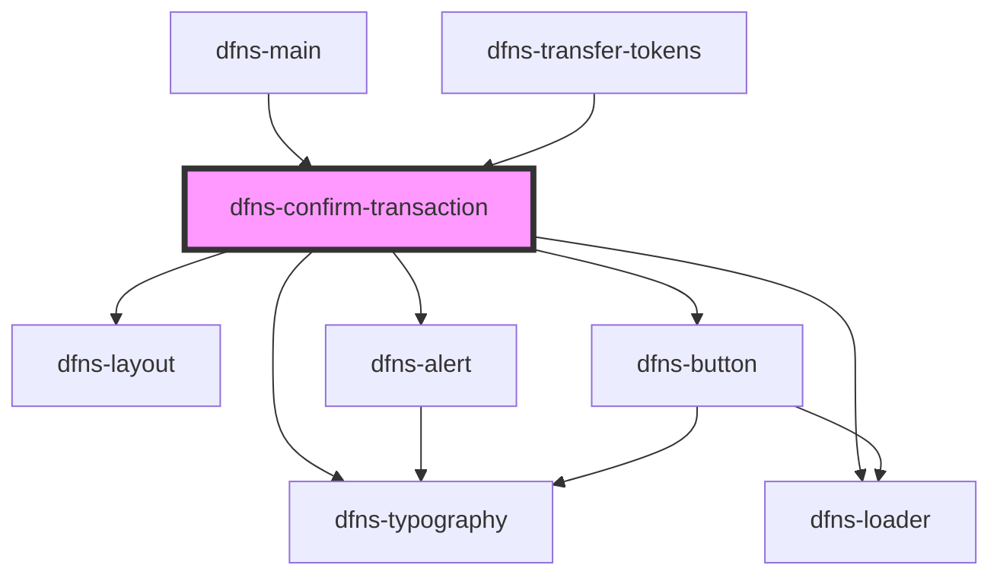

# dfns-create-account

<!-- Auto Generated Below -->

## Properties

| Property                    | Attribute              | Description | Type         | Default                                                                         |
| --------------------------- | ---------------------- | ----------- | ------------ | ------------------------------------------------------------------------------- |
| `backButtonCallback`        | --                     |             | `() => void` | `undefined`                                                                     |
| `confirmationImgSrc`        | `confirmation-img-src` |             | `string`     | `"https://storage.googleapis.com/dfns-frame-stg/assets/icons/confirmation.svg"` |
| `data`                      | `data`                 |             | `string`     | `undefined`                                                                     |
| `decimals`                  | `decimals`             |             | `number`     | `undefined`                                                                     |
| `dfnsTransfer`              | `dfns-transfer`        |             | `boolean`    | `false`                                                                         |
| `dfnsTransferSelectedToken` | --                     |             | `ITokenInfo` | `undefined`                                                                     |
| `to`                        | `to`                   |             | `string`     | `undefined`                                                                     |
| `tokenSymbol`               | `token-symbol`         |             | `string`     | `networkMapping[dfnsStore.state.network].nativeCurrency.symbol`                 |
| `txNonce`                   | `tx-nonce`             |             | `number`     | `undefined`                                                                     |
| `value`                     | `value`                |             | `string`     | `undefined`                                                                     |

## Events

| Event             | Description | Type                  |
| ----------------- | ----------- | --------------------- |
| `transactionSent` |             | `CustomEvent<string>` |

## Dependencies

### Used by

 - [dfns-main](../dfns-main)
 - [dfns-transfer-tokens](../dfns-transfer-tokens)

### Depends on

- [dfns-layout](../../Materials/Templates/dfns-layout)
- [dfns-typography](../../Elements/Typography/dfns-typography)
- [dfns-alert](../../Elements/Alerts/dfns-alert)
- [dfns-loader](../../Elements/LoaderDfns/dfns-loader)
- [dfns-button](../../Elements/Buttons/dfns-button)

### Graph

----------------------------------------------

*Built with [StencilJS](https://stenciljs.com/)*
