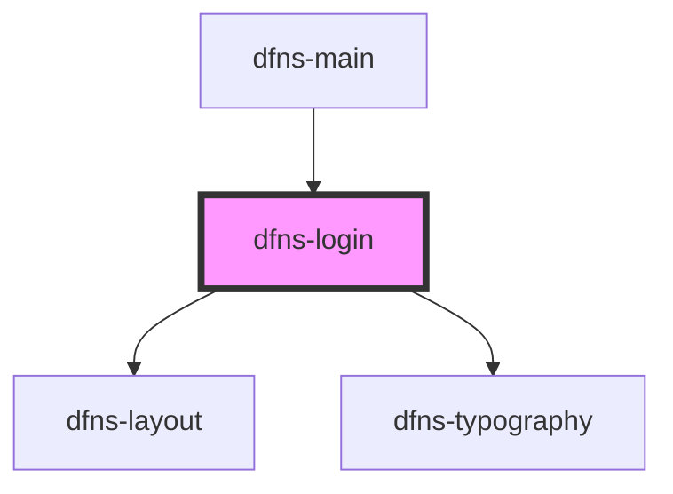

# dfns-create-account

<!-- Auto Generated Below -->

## Properties

| Property                  | Attribute                  | Description | Type                             | Default     |
| ------------------------- | -------------------------- | ----------- | -------------------------------- | ----------- |
| `authenticatorAttachment` | `authenticator-attachment` |             | `"cross-platform" \| "platform"` | `undefined` |

## Events

| Event            | Description | Type                                    |
| ---------------- | ----------- | --------------------------------------- |
| `passkeyCreated` |             | `CustomEvent<RegisterCompleteResponse>` |

## Dependencies

### Used by

 - [dfns-main](../dfns-main)

### Depends on

- [dfns-layout](../../Materials/Templates/dfns-layout)
- [dfns-typography](../../Elements/Typography/dfns-typography)

### Graph

----------------------------------------------

*Built with [StencilJS](https://stenciljs.com/)*
