# dfns-layout

<!-- Auto Generated Below -->

## Properties

| Property                              | Attribute                                | Description | Type                             | Default     |
| ------------------------------------- | ---------------------------------------- | ----------- | -------------------------------- | ----------- |
| `messageToSign`                       | `message-to-sign`                        |             | `string`                         | `undefined` |
| `network`                             | `network`                                |             | `BlockchainNetwork`              | `undefined` |
| `userCreationAuthenticatorAttachment` | `user-creation-authenticator-attachment` |             | `"cross-platform" \| "platform"` | `undefined` |

## Dependencies

### Depends on

- [dfns-create-account](../dfns-create-account)
- [dfns-recovery-setup](../dfns-recovery-setup)
- [dfns-validate-wallet](../dfns-validate-wallet)
- [dfns-wallet-validation](../dfns-wallet-validation)
- [dfns-sign-message](../dfns-sign-message)
- [dfns-settings](../dfns-settings)
- [dfns-create-passkey](../dfns-create-passkey)
- [dfns-wallet-overview](../dfns-wallet-overview)
- [dfns-login](../dfns-login)

### Graph

```mermaid
graph TD;
  dfns-main --> dfns-create-account
  dfns-main --> dfns-recovery-setup
  dfns-main --> dfns-validate-wallet
  dfns-main --> dfns-wallet-validation
  dfns-main --> dfns-sign-message
  dfns-main --> dfns-settings
  dfns-main --> dfns-create-passkey
  dfns-main --> dfns-wallet-overview
  dfns-main --> dfns-login
  dfns-create-account --> dfns-layout
  dfns-create-account --> dfns-typography
  dfns-create-account --> dfns-stepper
  dfns-create-account --> dfns-button
  dfns-button --> dfns-typography
  dfns-button --> dfns-loader
  dfns-recovery-setup --> dfns-layout
  dfns-recovery-setup --> dfns-typography
  dfns-recovery-setup --> dfns-input-field
  dfns-recovery-setup --> dfns-alert
  dfns-recovery-setup --> dfns-button
  dfns-input-field --> dfns-typography
  dfns-alert --> dfns-typography
  dfns-validate-wallet --> dfns-layout
  dfns-validate-wallet --> dfns-typography
  dfns-validate-wallet --> dfns-stepper
  dfns-validate-wallet --> dfns-button
  dfns-wallet-validation --> dfns-layout
  dfns-wallet-validation --> dfns-typography
  dfns-wallet-validation --> dfns-loader
  dfns-wallet-validation --> dfns-button
  dfns-sign-message --> dfns-layout
  dfns-sign-message --> dfns-typography
  dfns-sign-message --> dfns-button
  dfns-sign-message --> dfns-alert
  dfns-settings --> dfns-layout
  dfns-settings --> dfns-typography
  dfns-settings --> dfns-button
  dfns-settings --> toggle-switch
  dfns-settings --> dfns-alert
  dfns-create-passkey --> dfns-layout
  dfns-create-passkey --> dfns-typography
  dfns-create-passkey --> dfns-input-field
  dfns-create-passkey --> dfns-alert
  dfns-create-passkey --> dfns-button
  dfns-wallet-overview --> dfns-layout
  dfns-wallet-overview --> dfns-typography
  dfns-wallet-overview --> dfns-button
  dfns-wallet-overview --> dfns-alert
  dfns-login --> dfns-layout
  dfns-login --> dfns-typography
  style dfns-main fill:#f9f,stroke:#333,stroke-width:4px
```

----------------------------------------------

*Built with [StencilJS](https://stenciljs.com/)*
