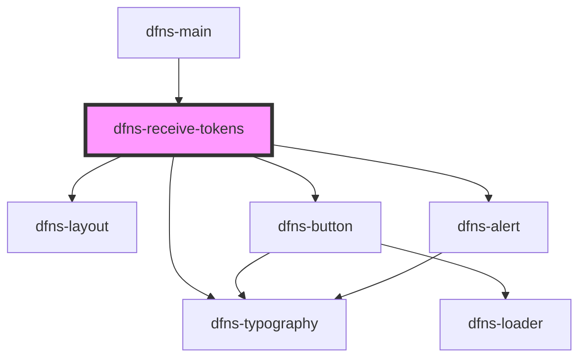

# dfns-receive-tokens

<!-- Auto Generated Below -->

## Dependencies

### Used by

 - [dfns-main](../dfns-main)

### Depends on

- [dfns-layout](../../Materials/Templates/dfns-layout)
- [dfns-typography](../../Elements/Typography/dfns-typography)
- [dfns-button](../../Elements/Buttons/dfns-button)
- [dfns-alert](../../Elements/Alerts/dfns-alert)

### Graph

----------------------------------------------

*Built with [StencilJS](https://stenciljs.com/)*
