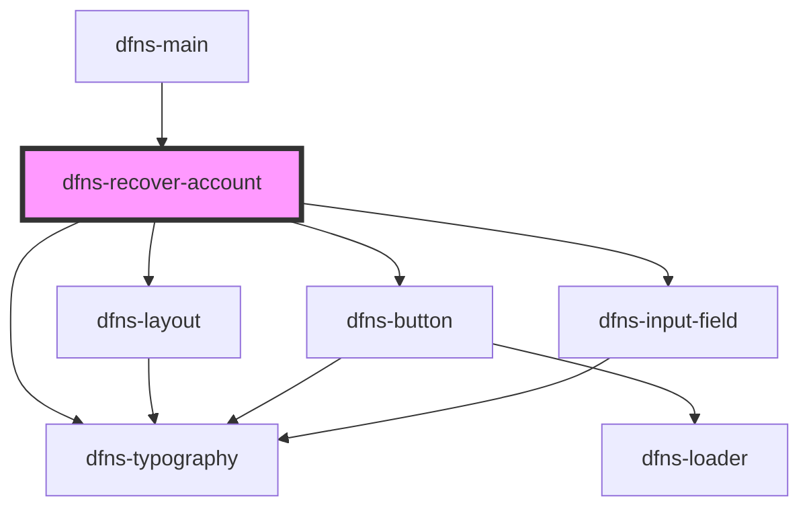

# dfns-recover-account

<!-- Auto Generated Below -->

## Events

| Event             | Description | Type                  |
| ----------------- | ----------- | --------------------- |
| `walletConnected` |             | `CustomEvent<string>` |

## Dependencies

### Used by

 - [dfns-main](../dfns-main)

### Depends on

- [dfns-layout](../../Materials/Templates/dfns-layout)
- [dfns-typography](../../Elements/Typography/dfns-typography)
- [dfns-button](../../Elements/Buttons/dfns-button)
- [dfns-input-field](../../Elements/Forms/InputField/dfns-input-field)

### Graph

----------------------------------------------

*Built with [StencilJS](https://stenciljs.com/)*
