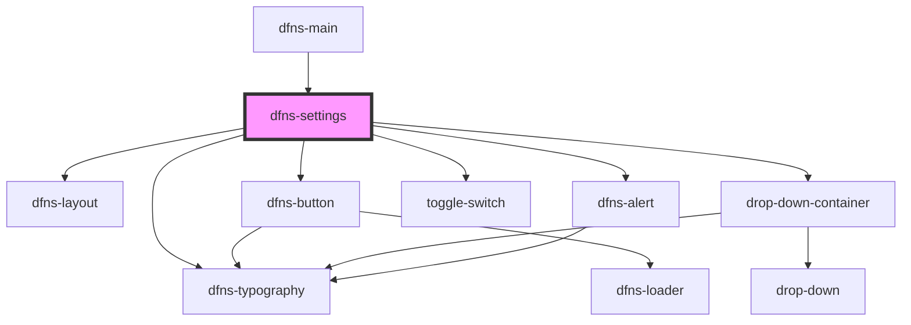

# dfns-create-account

<!-- Auto Generated Below -->

## Properties

| Property             | Attribute              | Description | Type     | Default                                                                         |
| -------------------- | ---------------------- | ----------- | -------- | ------------------------------------------------------------------------------- |
| `confirmationImgSrc` | `confirmation-img-src` |             | `string` | `"https://storage.googleapis.com/dfns-frame-stg/assets/icons/confirmation.svg"` |

## Events

| Event    | Description | Type                                                                                        |
| -------- | ----------- | ------------------------------------------------------------------------------------------- |
| `action` |             | `CustomEvent<SettingsAction.BACK \| SettingsAction.CLOSE \| SettingsAction.CREATE_PASSKEY>` |

## Dependencies

### Used by

 - [dfns-main](../dfns-main)

### Depends on

- [dfns-layout](../../Materials/Templates/dfns-layout)
- [dfns-typography](../../Elements/Typography/dfns-typography)
- [dfns-button](../../Elements/Buttons/dfns-button)
- [drop-down-container](../../Elements/DropDown/drop-down-container)
- [toggle-switch](../../Elements/ToggleSwitch/toggle-switch)
- [dfns-alert](../../Elements/Alerts/dfns-alert)

### Graph

----------------------------------------------

*Built with [StencilJS](https://stenciljs.com/)*
