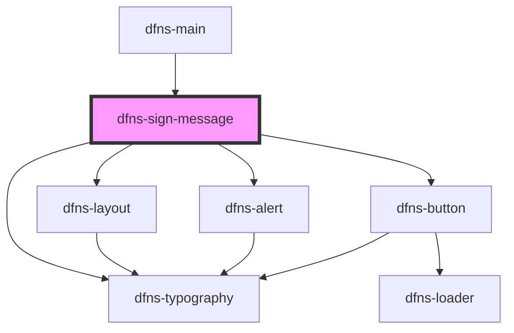

# dfns-create-account

<!-- Auto Generated Below -->

## Properties

| Property  | Attribute | Description | Type     | Default     |
| --------- | --------- | ----------- | -------- | ----------- |
| `message` | `message` |             | `string` | `undefined` |

## Events

| Event           | Description | Type                  |
| --------------- | ----------- | --------------------- |
| `signedMessage` |             | `CustomEvent<string>` |

## Dependencies

### Used by

 - [dfns-main](../dfns-main)

### Depends on

- [dfns-layout](../../Materials/Templates/dfns-layout)
- [dfns-typography](../../Elements/Typography/dfns-typography)
- [dfns-alert](../../Elements/Alerts/dfns-alert)
- [dfns-button](../../Elements/Buttons/dfns-button)

### Graph

----------------------------------------------

*Built with [StencilJS](https://stenciljs.com/)*
