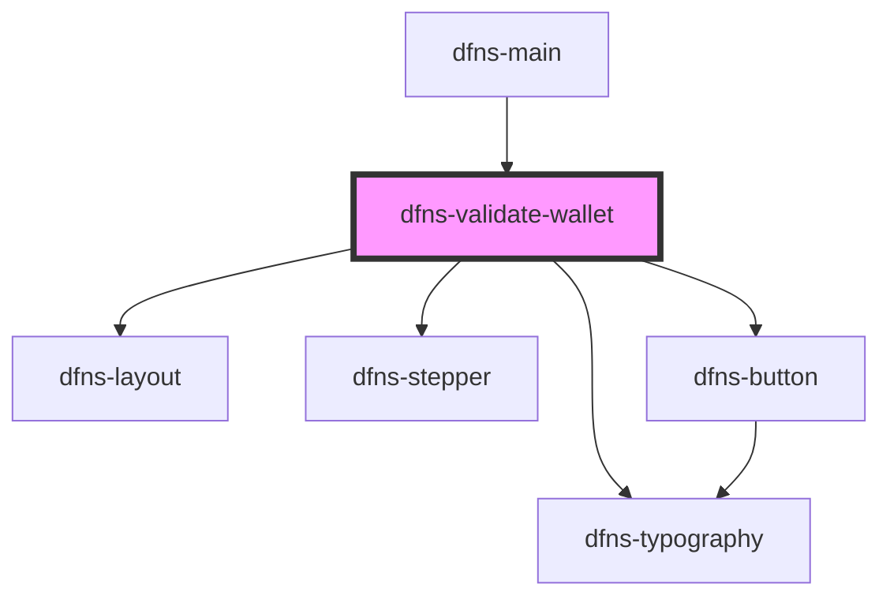

# dfns-create-account

<!-- Auto Generated Below -->

## Events

| Event             | Description | Type                                                                                                                                                                                                 |
| ----------------- | ----------- | ---------------------------------------------------------------------------------------------------------------------------------------------------------------------------------------------------- |
| `walletValidated` |             | `CustomEvent<{ id: string; network: BlockchainNetwork; status: WalletStatus; signingKey?: SigningKey; address?: string; name?: string; externalId?: string; tags: string[]; dateCreated: string; }>` |

## Dependencies

### Used by

 - [dfns-main](../dfns-main)

### Depends on

- [dfns-layout](../../ Materials/Templates/dfns-layout)
- [dfns-typography](../../Elements/Typography/dfns-typography)
- [dfns-stepper](../../Elements/Stepper/dfns-stepper)
- [dfns-button](../../Elements/Buttons/dfns-button)

### Graph

----------------------------------------------

*Built with [StencilJS](https://stenciljs.com/)*
