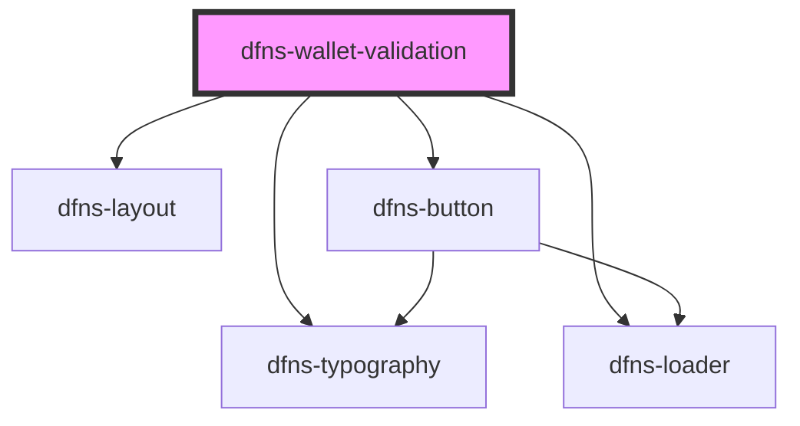

# dfns-create-account

<!-- Auto Generated Below -->

## Properties

| Property             | Attribute              | Description | Type     | Default                                                                         |
| -------------------- | ---------------------- | ----------- | -------- | ------------------------------------------------------------------------------- |
| `appId`              | `app-id`               |             | `string` | `undefined`                                                                     |
| `confirmationImgSrc` | `confirmation-img-src` |             | `string` | `"https://storage.googleapis.com/dfns-frame-stg/assets/icons/confirmation.svg"` |
| `dfnsHost`           | `dfns-host`            |             | `string` | `undefined`                                                                     |
| `dfnsUserToken`      | `dfns-user-token`      |             | `string` | `undefined`                                                                     |
| `rpId`               | `rp-id`                |             | `string` | `undefined`                                                                     |
| `visible`            | `visible`              |             | `string` | `undefined`                                                                     |
| `walletId`           | `wallet-id`            |             | `string` | `undefined`                                                                     |

## Events

| Event             | Description | Type                                                                                                                                                                                                 |
| ----------------- | ----------- | ---------------------------------------------------------------------------------------------------------------------------------------------------------------------------------------------------- |
| `walletValidated` |             | `CustomEvent<{ id: string; network: BlockchainNetwork; status: WalletStatus; signingKey?: SigningKey; address?: string; name?: string; externalId?: string; tags: string[]; dateCreated: string; }>` |

## Dependencies

### Depends on

- [dfns-layout](../../ Materials/Templates/dfns-layout)
- [dfns-typography](../../Elements/Typography/dfns-typography)
- [dfns-loader](../../Elements/Loader/dfns-loader)
- [dfns-button](../../Elements/Buttons/dfns-button)

### Graph

----------------------------------------------

*Built with [StencilJS](https://stenciljs.com/)*
