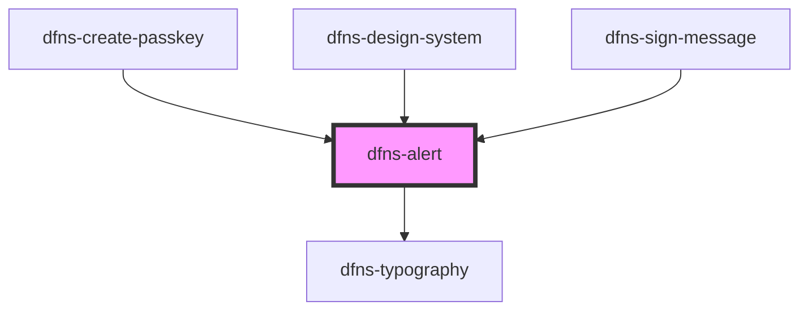

# dfns-alert

<!-- Auto Generated Below -->

## Properties

| Property         | Attribute          | Description | Type                                                                                          | Default                            |
| ---------------- | ------------------ | ----------- | --------------------------------------------------------------------------------------------- | ---------------------------------- |
| `classCss`       | `class-css`        |             | `string`                                                                                      | `undefined`                        |
| `errorIconSrc`   | `error-icon-src`   |             | `string`                                                                                      | `"icons/x-circle.svg"`             |
| `hasTitle`       | `has-title`        |             | `boolean`                                                                                     | `false`                            |
| `infoIconSrc`    | `info-icon-src`    |             | `string`                                                                                      | `"icons/exclamation-circle.svg"`   |
| `variant`        | `variant`          |             | `EAlertVariant.ERROR \| EAlertVariant.INFO \| EAlertVariant.SUCCESS \| EAlertVariant.WARNING` | `EAlertVariant.INFO`               |
| `warningIconSrc` | `warning-icon-src` |             | `string`                                                                                      | `"icons/exclamation-triangle.svg"` |

## Dependencies

### Used by

 - [dfns-create-passkey](../dfns-create-passkey)
 - [dfns-design-system](../dfns-design-system)
 - [dfns-sign-message](../dfns-sign-message)

### Depends on

- [dfns-typography](../dfns-typography)

### Graph

----------------------------------------------

*Built with [StencilJS](https://stenciljs.com/)*
