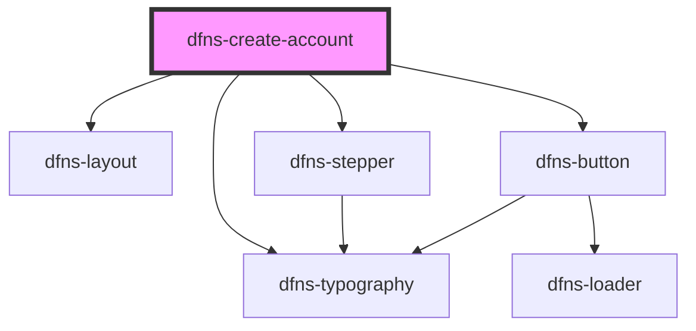

# dfns-create-account

<!-- Auto Generated Below -->

## Properties

| Property           | Attribute            | Description | Type     | Default     |
| ------------------ | -------------------- | ----------- | -------- | ----------- |
| `oauthAccessToken` | `oauth-access-token` |             | `string` | `undefined` |
| `rpId`             | `rp-id`              |             | `string` | `undefined` |
| `visible`          | `visible`            |             | `string` | `undefined` |

## Events

| Event            | Description | Type                                    |
| ---------------- | ----------- | --------------------------------------- |
| `passkeyCreated` |             | `CustomEvent<RegisterCompleteResponse>` |

## Dependencies

### Depends on

- [dfns-layout](../dfns-layout)
- [dfns-typography](../dfns-typography)
- [dfns-stepper](../dfns-stepper)
- [dfns-button](../dfns-button)

### Graph

----------------------------------------------

*Built with [StencilJS](https://stenciljs.com/)*
