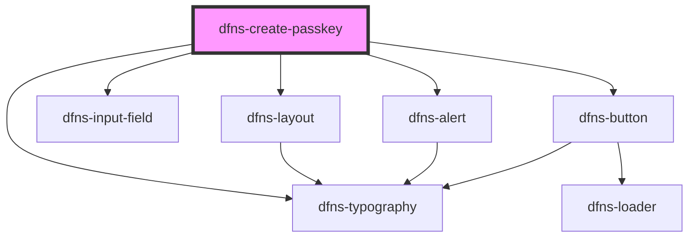

# dfns-create-passkey

<!-- Auto Generated Below -->

## Properties

| Property  | Attribute | Description | Type     | Default     |
| --------- | --------- | ----------- | -------- | ----------- |
| `visible` | `visible` |             | `string` | `undefined` |

## Dependencies

### Depends on

- [dfns-layout](../dfns-layout)
- [dfns-typography](../dfns-typography)
- [dfns-input-field](../dfns-input-field)
- [dfns-alert](../dfns-alert)
- [dfns-button](../dfns-button)

### Graph

----------------------------------------------

*Built with [StencilJS](https://stenciljs.com/)*
