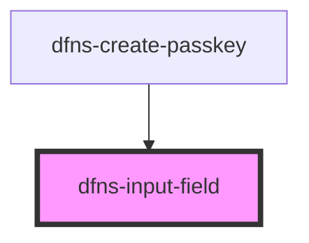

# dfns-input-field

<!-- Auto Generated Below -->

## Properties

| Property        | Attribute        | Description | Type       | Default     |
| --------------- | ---------------- | ----------- | ---------- | ----------- |
| `disableErrors` | `disable-errors` |             | `boolean`  | `undefined` |
| `errors`        | --               |             | `string[]` | `undefined` |
| `isReadOnly`    | `is-read-only`   |             | `boolean`  | `undefined` |
| `leftElement`   | `left-element`   |             | `any`      | `undefined` |
| `placeholder`   | `placeholder`    |             | `string`   | `undefined` |
| `rightElement`  | `right-element`  |             | `any`      | `undefined` |
| `type`          | `type`           |             | `string`   | `undefined` |
| `value`         | `value`          |             | `string`   | `undefined` |

## Events

| Event    | Description | Type                  |
| -------- | ----------- | --------------------- |
| `change` |             | `CustomEvent<string>` |

## Dependencies

### Used by

 - [dfns-create-passkey](../dfns-create-passkey)

### Graph

----------------------------------------------

*Built with [StencilJS](https://stenciljs.com/)*
