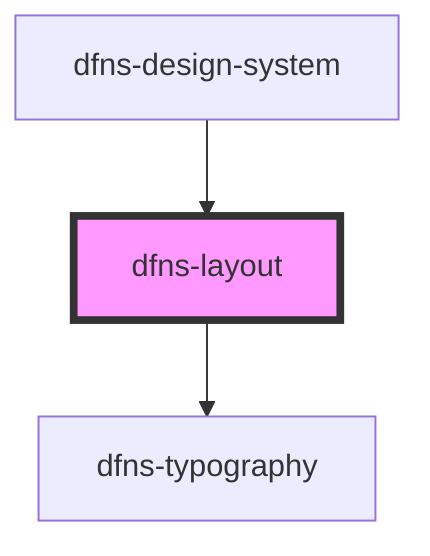

# dfns-layout

<!-- Auto Generated Below -->

## Properties

| Property                   | Attribute                     | Description | Type      | Default                |
| -------------------------- | ----------------------------- | ----------- | --------- | ---------------------- |
| `bloomLogoSrc`             | `bloom-logo-src`              |             | `string`  | `"images/bloom.svg"`   |
| `closeBtn`                 | `close-btn`                   |             | `boolean` | `undefined`            |
| `closeBtnShouldDisconnect` | `close-btn-should-disconnect` |             | `boolean` | `undefined`            |
| `crossIconSrc`             | `cross-icon-src`              |             | `string`  | `"icons/cross.svg"`    |
| `molitorLogoSrc`           | `molitor-logo-src`            |             | `string`  | `"images/molitor.svg"` |

## Dependencies

### Used by

 - [dfns-design-system](../dfns-design-system)

### Depends on

- [dfns-typography](../dfns-typography)

### Graph

----------------------------------------------

*Built with [StencilJS](https://stenciljs.com/)*
