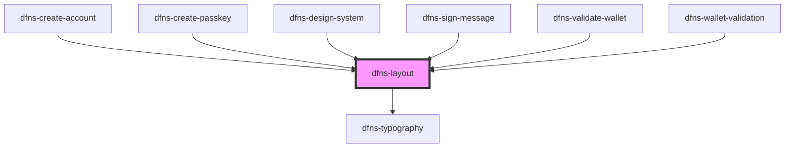

# dfns-layout

<!-- Auto Generated Below -->

## Properties

| Property          | Attribute          | Description | Type         | Default                                                                       |
| ----------------- | ------------------ | ----------- | ------------ | ----------------------------------------------------------------------------- |
| `bloomLogoSrc`    | `bloom-logo-src`   |             | `string`     | `"https://storage.cloud.google.com/dfns-frame-stg/assets/images/bloom.svg"`   |
| `closeBtn`        | `close-btn`        |             | `boolean`    | `undefined`                                                                   |
| `crossIconSrc`    | `cross-icon-src`   |             | `string`     | `"https://storage.cloud.google.com/dfns-frame-stg/assets/icons/cross.svg"`    |
| `molitorLogoSrc`  | `molitor-logo-src` |             | `string`     | `"https://storage.cloud.google.com/dfns-frame-stg/assets/images/molitor.svg"` |
| `onClickCloseBtn` | --                 |             | `() => void` | `undefined`                                                                   |

## Dependencies

### Used by

 - [dfns-create-account](../dfns-create-account)
 - [dfns-create-passkey](../dfns-create-passkey)
 - [dfns-design-system](../dfns-design-system)
 - [dfns-sign-message](../dfns-sign-message)
 - [dfns-validate-wallet](../dfns-validate-wallet)
 - [dfns-wallet-validation](../dfns-wallet-validation)

### Depends on

- [dfns-typography](../dfns-typography)

### Graph

----------------------------------------------

*Built with [StencilJS](https://stenciljs.com/)*
