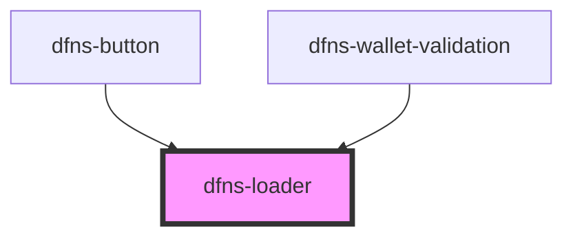

# dfns-loader

<!-- Auto Generated Below -->

## Properties

| Property        | Attribute         | Description | Type     | Default                                                                   |
| --------------- | ----------------- | ----------- | -------- | ------------------------------------------------------------------------- |
| `LoaderIconSrc` | `loader-icon-src` |             | `string` | `"https://storage.googleapis.com/dfns-frame-stg/assets/icons/loader.svg"` |
| `classCss`      | `class-css`       |             | `string` | `undefined`                                                               |

## Dependencies

### Used by

 - [dfns-button](../dfns-button)
 - [dfns-wallet-validation](../dfns-wallet-validation)

### Graph

----------------------------------------------

*Built with [StencilJS](https://stenciljs.com/)*
