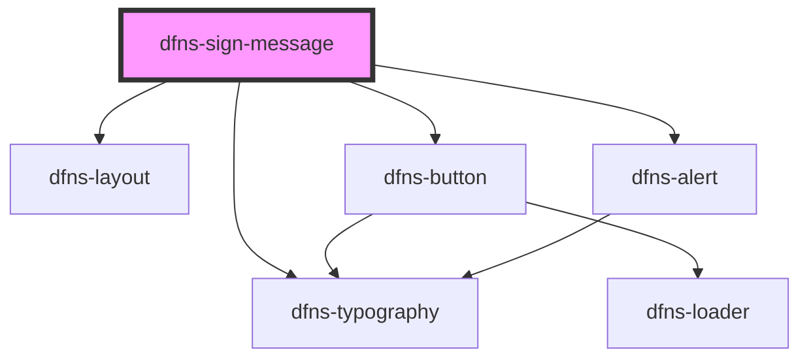

# dfns-create-account

<!-- Auto Generated Below -->

## Properties

| Property        | Attribute         | Description | Type     | Default     |
| --------------- | ----------------- | ----------- | -------- | ----------- |
| `appId`         | `app-id`          |             | `string` | `undefined` |
| `dfnsUserToken` | `dfns-user-token` |             | `string` | `undefined` |
| `message`       | `message`         |             | `string` | `undefined` |
| `rpId`          | `rp-id`           |             | `string` | `undefined` |
| `visible`       | `visible`         |             | `string` | `undefined` |
| `walletId`      | `wallet-id`       |             | `string` | `undefined` |

## Events

| Event           | Description | Type                                                                                                                                                                                                                                                                                                                                             |
| --------------- | ----------- | ------------------------------------------------------------------------------------------------------------------------------------------------------------------------------------------------------------------------------------------------------------------------------------------------------------------------------------------------ |
| `signedMessage` |             | `CustomEvent<{ id: string; walletId: string; network: BlockchainNetwork; requester: RequesterIdentity; requestBody: GenerateSignatureBody; signature?: Signature; status: SignatureStatus; txHash?: string; fee?: string; dateRequested: string; datePolicyEvaluated?: string; dateSigned?: string; dateConfirmed?: string; reason?: string; }>` |

## Dependencies

### Depends on

- [dfns-layout](../dfns-layout)
- [dfns-typography](../dfns-typography)
- [dfns-button](../dfns-button)
- [dfns-alert](../dfns-alert)

### Graph

----------------------------------------------

*Built with [StencilJS](https://stenciljs.com/)*
