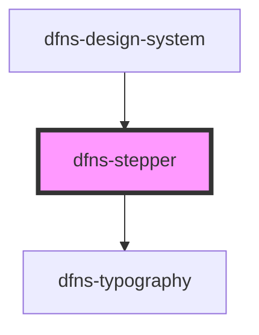

# dfns-stepper

<!-- Auto Generated Below -->

## Properties

| Property        | Attribute   | Description | Type       | Default     |
| --------------- | ----------- | ----------- | ---------- | ----------- |
| `activeIndices` | --          |             | `number[]` | `[]`        |
| `classCss`      | `class-css` |             | `string`   | `undefined` |
| `icon`          | `icon`      |             | `string`   | `undefined` |
| `iconstyle`     | `iconstyle` |             | `string`   | `undefined` |
| `steps`         | --          |             | `string[]` | `[]`        |

## Dependencies

### Used by

 - [dfns-design-system](../dfns-design-system)

### Depends on

- [dfns-typography](../dfns-typography)

### Graph

----------------------------------------------

*Built with [StencilJS](https://stenciljs.com/)*
