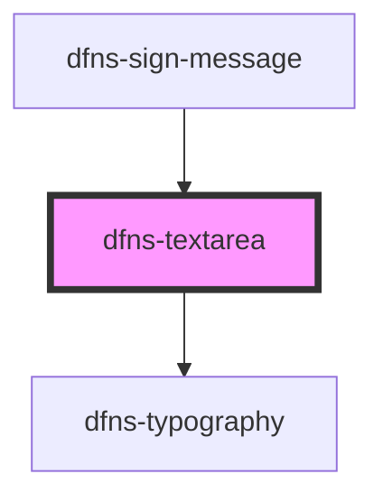

# dfns-textarea

<!-- Auto Generated Below -->

## Properties

| Property        | Attribute        | Description | Type     | Default |
| --------------- | ---------------- | ----------- | -------- | ------- |
| `appName`       | `app-name`       |             | `string` | `""`    |
| `nonceValue`    | `nonce-value`    |             | `string` | `""`    |
| `privacyLink`   | `privacy-link`   |             | `string` | `""`    |
| `tosLink`       | `tos-link`       |             | `string` | `""`    |
| `walletAddress` | `wallet-address` |             | `string` | `""`    |

## Dependencies

### Used by

 - [dfns-sign-message](../dfns-sign-message)

### Depends on

- [dfns-typography](../dfns-typography)

### Graph

----------------------------------------------

*Built with [StencilJS](https://stenciljs.com/)*
