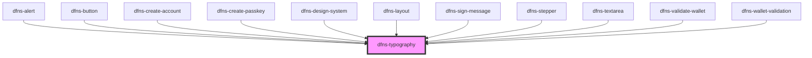

# dfns-typography

<!-- Auto Generated Below -->

## Properties

| Property   | Attribute   | Description | Type                                                                                                        | Default     |
| ---------- | ----------- | ----------- | ----------------------------------------------------------------------------------------------------------- | ----------- |
| `classCss` | `class-css` |             | `string`                                                                                                    | `undefined` |
| `color`    | `color`     |             | `ITypoColor.BLACK \| ITypoColor.INVERTED \| ITypoColor.PRIMARY \| ITypoColor.SECONDARY \| ITypoColor.WHITE` | `undefined` |
| `typo`     | `typo`      |             | `ITypo`                                                                                                     | `undefined` |

## Dependencies

### Used by

 - [dfns-alert](../dfns-alert)
 - [dfns-button](../dfns-button)
 - [dfns-create-account](../dfns-create-account)
 - [dfns-create-passkey](../dfns-create-passkey)
 - [dfns-design-system](../dfns-design-system)
 - [dfns-layout](../dfns-layout)
 - [dfns-sign-message](../dfns-sign-message)
 - [dfns-stepper](../dfns-stepper)
 - [dfns-textarea](../dfns-textarea)
 - [dfns-validate-wallet](../dfns-validate-wallet)
 - [dfns-wallet-validation](../dfns-wallet-validation)

### Graph

----------------------------------------------

*Built with [StencilJS](https://stenciljs.com/)*
