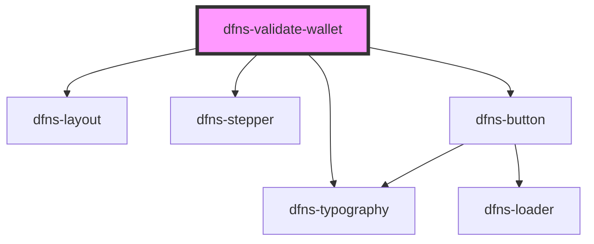

# dfns-create-account

<!-- Auto Generated Below -->

## Properties

| Property        | Attribute         | Description | Type     | Default     |
| --------------- | ----------------- | ----------- | -------- | ----------- |
| `apiUrl`        | `api-url`         |             | `string` | `undefined` |
| `appId`         | `app-id`          |             | `string` | `undefined` |
| `dfnsHost`      | `dfns-host`       |             | `string` | `undefined` |
| `dfnsUserToken` | `dfns-user-token` |             | `string` | `undefined` |
| `rpId`          | `rp-id`           |             | `string` | `undefined` |
| `visible`       | `visible`         |             | `string` | `undefined` |

## Events

| Event             | Description | Type                                                                                                                                                                                                 |
| ----------------- | ----------- | ---------------------------------------------------------------------------------------------------------------------------------------------------------------------------------------------------- |
| `walletValidated` |             | `CustomEvent<{ id: string; network: BlockchainNetwork; status: WalletStatus; signingKey?: SigningKey; address?: string; name?: string; externalId?: string; tags: string[]; dateCreated: string; }>` |

## Dependencies

### Depends on

- [dfns-layout](../dfns-layout)
- [dfns-typography](../dfns-typography)
- [dfns-stepper](../dfns-stepper)
- [dfns-button](../dfns-button)

### Graph

----------------------------------------------

*Built with [StencilJS](https://stenciljs.com/)*
